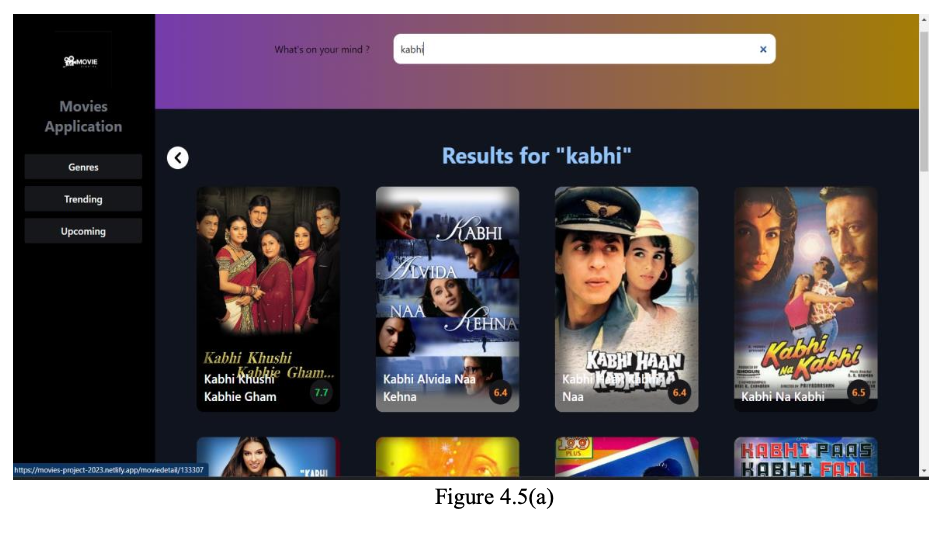

Emotion-Based Movie Catalog

A movie recommendation web app that suggests films based on user emotions using AI/NLP sentiment analysis.

##Live Demo
**Live Demo:** [Click here to try it out](https://movies-project-2023.netlify.app)

## Overview:
This project detects user emotions (e.g., happy, sad, angry, etc.) from text input and recommends movies that align with the detected mood.  
It aims to enhance personalized recommendations using emotion-driven insights.

## How It Works:
1. User enters a sentence describing how they feel.  
2. The system analyzes the sentiment/emotion using NLP.  
3. Based on the emotion, it suggests a set of movies related to that mood.

## Demo Screenshots:  

Home Page

trending

cast

genres

emotion keyword

